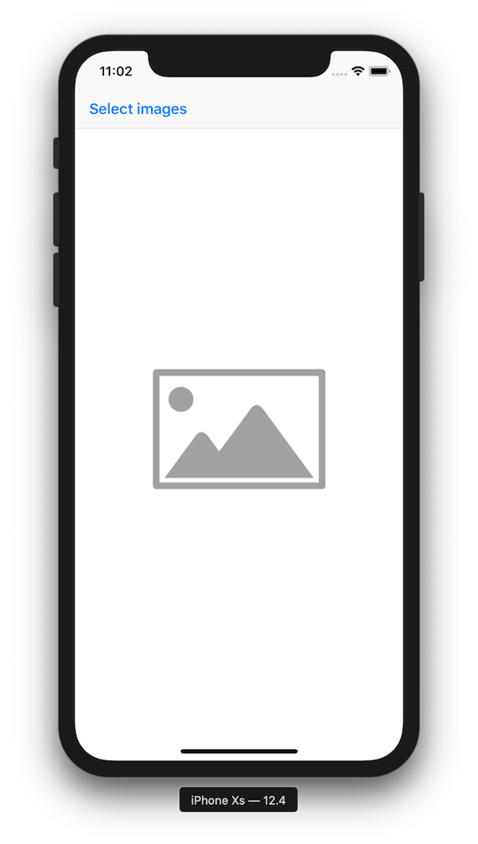
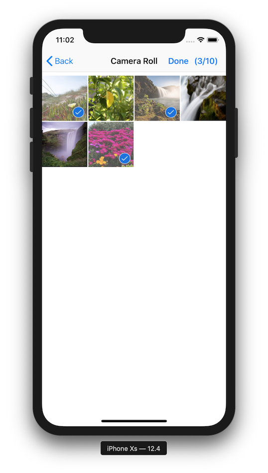
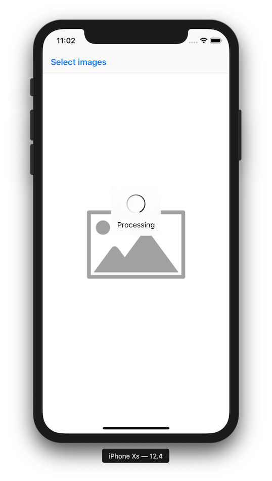
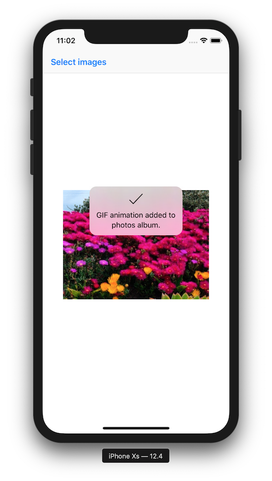
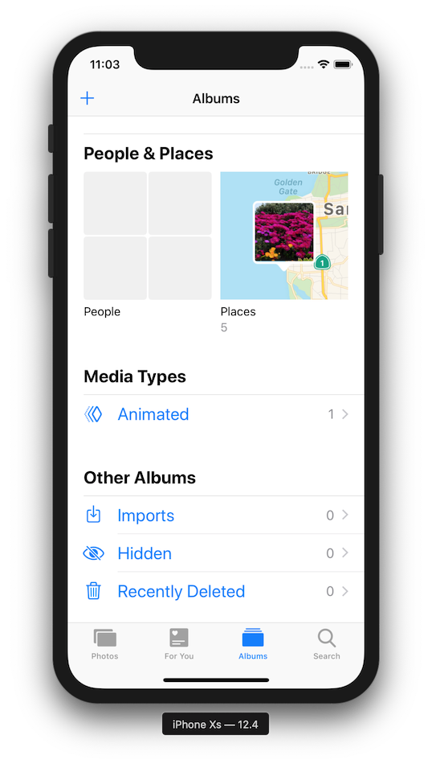
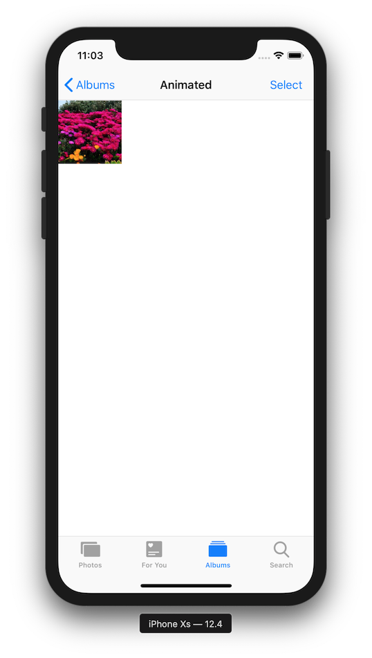
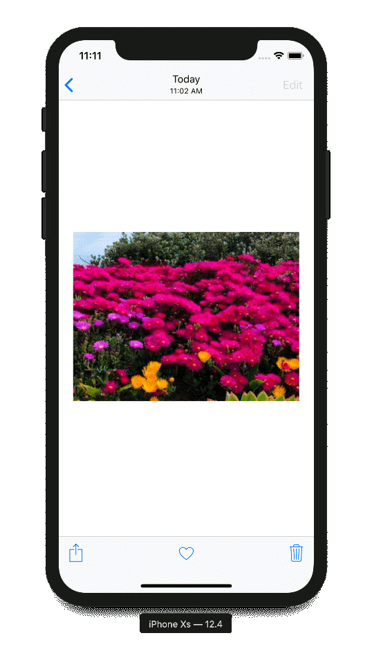

# AnimateDemo

This demo generates a GIF animation using [FilestackSDK](http://github.com/filestack/filestack-swift)'s transformation API from user picked images (up to 10) and adds it to the photos album. GIF animation will display under "Animated" photos album (iOS 11+.)

## Requirements

* Xcode 10.3 or later
* iOS 11 or later
* CocoaPods

## Installing

`$ pod install`

## Setup

1. Open `AnimateDemo.xcworkspace` in Xcode.
2. Set `filestackAPIKey` and `filestackAppSecret` in `FilestackSetup.swift`.
3. Done.

## Launch

- Go to `Product` menu and click `Run` (or `⌘ + R`).

## Screenshots

||||
|---|---|---|
||||
||||
||||
